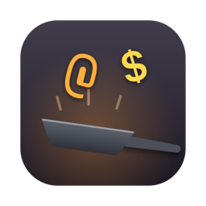
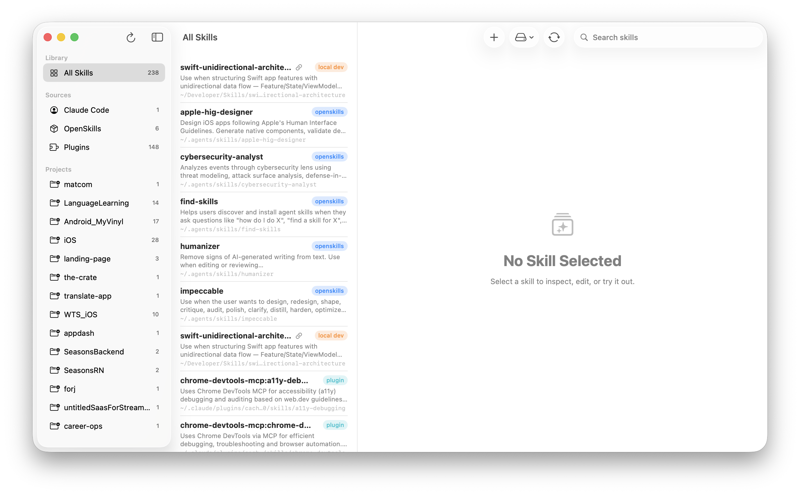

<p align="center">
  
</p>

<h1 align="center">Skillet</h1>

<p align="center">
  <strong>The macOS home for your AI agent skills.</strong><br>
  Index, customize, diff, update, back up, and try out every skill on your machine — from one window.
</p>

<p align="center">
  
  
  
  
</p>

<p align="center">
  
</p>

---

Agent skills — the `SKILL.md` instruction bundles used by Claude Code and
friends — end up scattered across your machine: some installed by
[openskills](https://github.com/numman-ali/openskills), some by plugins, some
symlinked from dev checkouts, some hand-rolled. Each tool manages its own
corner. Skillet is the umbrella: one app that finds them all, shows where they
came from, remembers every change you make, and keeps them in sync with their
upstream repositories.

## Features

### 🔍 Indexes every ecosystem

| Source | Location | What Skillet detects |
|---|---|---|
| **Claude Code** | `~/.claude/skills` | Plain skills, gstack-managed bundles (symlinked `SKILL.md`), and skills symlinked to local dev checkouts (with their git repo) |
| **OpenSkills** | `~/.agents/skills` | Installs matched to their GitHub source repository via `.skill-lock.json` |
| **Plugins** | `~/.claude/plugins` | Skills bundled inside globally enabled Claude Code plugins, with plugin name, marketplace, and version |
| **Projects** | `<project>/.claude/skills` | Per-project skills, discovered from Claude Code's project registry — plus plugin skills enabled *only* in that project |
| **Custom** | anywhere | Extra folders you add in Settings |

The sidebar groups all of it hierarchically — **Library → Sources →
Projects** — so you can see at a glance that a skill exists only inside one
specific project. Every row shows its on-disk path, an origin badge
(`openskills`, `gstack`, `local dev`, `plugin`, `unmanaged`), and a symlink
indicator.

### ✏️ Customize — and never lose a customization

Skillet maintains a **shadow git repository** at
`~/Library/Application Support/Skillet/snapshots`. Every skill gets a baseline
checkpoint the first time it's indexed; from then on:

- Every save in the built-in **Editor** becomes a commit (⌘S)
- The **Changes** tab shows a live unified diff against the last checkpoint,
  the full checkpoint history, and one-click **restore** to any point
- Manual checkpoints with custom messages whenever you want a restore point
- Deleting a skill checkpoints it first, then moves it to the Trash —
  recoverable even after the Trash is emptied

Edits write *through* symlinks, so customizing a gstack-managed or
dev-symlinked skill updates its real source (the editor warns you when that's
the case).

### 🔄 Update with a real diff

For skills with a known upstream (openskills installs), the **Upstream** tab:

- Shallow-clones the source repository into a local cache
- Shows the exact unified diff between your local copy and upstream
- Applies the upstream version with one click — your current state is
  checkpointed first, so local customizations are always recoverable
- A toolbar action checks **all** repo-tracked skills at once and badges the
  ones that differ

### 💾 Back up and restore

Export every skill into a portable zip — symlinks are resolved to real
content, and a `manifest.json` records each skill's name, source ecosystem,
origin, and repository. Restoring is selective: pick the skills you want,
see which already exist, and choose whether to overwrite.

### 🖥️ Built-in terminal

Every skill has a **Terminal** tab hosting a real shell
([SwiftTerm](https://github.com/migueldeicaza/SwiftTerm)) rooted in the
skill's directory — launch `claude` right there to try the skill out. The
session survives tab switches.

### ✨ On-device AI (Apple Intelligence)

When Apple Intelligence is available, Skillet uses the FoundationModels
framework — fully on-device, nothing leaves your Mac:

- **New Skill wizard**: describe what the skill should do in plain language;
  the model drafts the kebab-case name, the trigger description, and a
  structured `SKILL.md` body
- **Diff summaries**: one click turns any pending or upstream diff into a
  few plain-language bullets

All AI affordances hide themselves when the model isn't available.

## The detail view

| Tab | What it does |
|---|---|
| **Overview** | Frontmatter metadata, origin and repository, install dates, file stats, `SKILL.md` preview |
| **Editor** | Edit any text file in the skill; saves are checkpointed automatically |
| **Changes** | Diff vs. last checkpoint, checkpoint history, restore |
| **Upstream** | Diff vs. the source repository, apply updates |
| **Files** | Browse the full contents; open or reveal anything |
| **Terminal** | Shell session in the skill's directory |

## Installation

### Build from source

```bash
brew install xcodegen
git clone https://github.com/mcomisso/skillet.git
cd skillet
xcodegen generate
xcodebuild -project Skillet.xcodeproj -scheme Skillet build
```

Or open `Skillet.xcodeproj` in Xcode 26+ and hit Run.

### Requirements

- **macOS 26 (Tahoe)** or later
- **Xcode 26** + [XcodeGen](https://github.com/yonaskolb/XcodeGen) to build
- `git` (ships with the Xcode Command Line Tools)
- Apple Intelligence enabled — optional, only for the AI features

### Good to know

- **Not sandboxed.** Skillet manages files in `~/.claude` and `~/.agents`,
  runs `git`, and hosts a PTY shell — all things the App Sandbox prohibits.
  Hardened runtime is enabled.
- **Local-only.** The only network traffic is `git clone`/`fetch` of the
  skill repositories you ask it to compare against. No telemetry, no
  accounts, no cloud.
- **Self-contained state.** Everything Skillet creates lives in
  `~/Library/Application Support/Skillet/` (`snapshots/` — the checkpoint
  repo, `upstreams/` — cached clones). Delete that folder and Skillet
  rebuilds baselines on next launch. Your skills themselves are never moved.
- **Plays nice with other managers.** Skillet never rewrites the openskills
  lockfile or plugin registries — it reads them for provenance and leaves
  ownership where it belongs.
- **Auto-updates.** Built-in [Sparkle](https://sparkle-project.org) updater:
  **Skillet → Check for Updates…** pulls EdDSA-signed releases from this
  repo's appcast. No account, no store.

## Architecture

SwiftUI + a lightweight unidirectional architecture (vendored as
`UnidirectionalKit`): stateless `Feature` structs process actions against a
`Mutable<State>` owned by a generic `ViewModel`, with granular per-field
observation. Views get read-only state access — mutations only flow through
actions, enforced by the type system.

```
View → send(Action) → ViewModel → Feature.handle(state, action, deps) → mutates State → View updates
```

| Layer | Pieces |
|---|---|
| **Services** | `SkillScanner`, `GitService`, `SnapshotStore`, `UpdateService`, `BackupService`, `AIAssistant`, `ProcessRunner` |
| **Features** | `AppFeature`, `SkillDetailFeature`, `NewSkillFeature` |
| **Views** | `NavigationSplitView` shell, six detail tabs, sheets for creation and restore |

Persistence is **files + git** — no database. The shadow repo gives diffing,
history, and restore for free, and it's plain git: you can inspect it with
any git client.

`project.yml` is the source of truth (XcodeGen) — never edit the
`.xcodeproj` directly.

### The icon

The app icon is generated by code — a skillet tossing `@` and `$`, drawn
with CoreGraphics:

```bash
swift scripts/generate-icon.swift /tmp/skillet_1024.png
```

## Releasing

Skillet ships **outside the Mac App Store** (the app is intentionally not
sandboxed, which the App Store requires). Releases are Developer ID-signed,
notarized, and published as DMGs on GitHub Releases via
[fastlane](https://fastlane.tools):

```bash
fastlane mac test                    # run the unit tests
fastlane mac build                   # signed + notarized .app in build/
fastlane mac release version:0.2.0   # bump, test, build, notarize, DMG, tag, GitHub Release
```

The release lane bumps `MARKETING_VERSION`/`CURRENT_PROJECT_VERSION` in
`project.yml`, signs the DMG with Skillet's Sparkle EdDSA key, regenerates
`appcast.xml` (the update feed installed apps poll), commits and tags
`v<version>`, and publishes the DMG with auto-generated release notes
(`gh` CLI auth is reused — no token setup). Notarization needs credentials
once: copy `fastlane/.env.example` to `fastlane/.env` and fill in an App
Store Connect **API key** (preferred — pure auth for the notary service,
nothing App Store-related) or an Apple ID app-specific password.

Existing installs pick the release up automatically via Sparkle.

## Contributing

Issues and PRs welcome. The codebase is small and deliberately boring:
follow the existing Feature/State/Action pattern, keep services as
protocol-backed `Sendable` types, and run the tests:

```bash
xcodebuild -project Skillet.xcodeproj -scheme Skillet test
```

## License

MIT — see [LICENSE](LICENSE).
